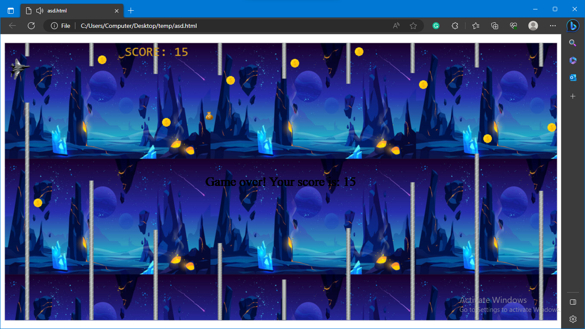
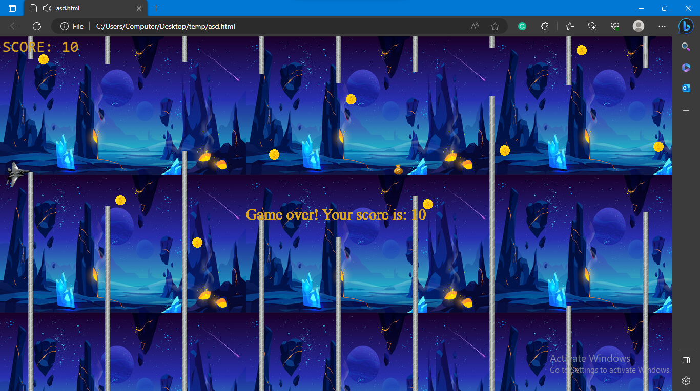
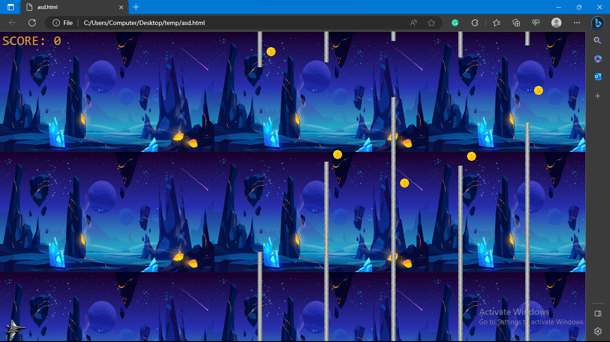
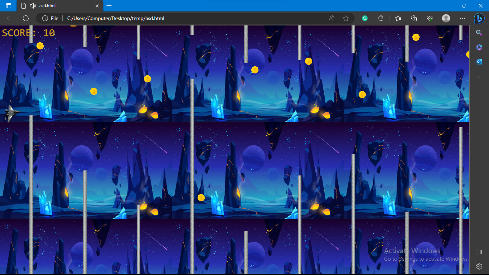

# Sky-Dodger-Coin-Collector

This is a simple game implemented in JavaScript using HTML5 canvas. The game involves controlling a game piece and avoiding obstacles while collecting coins and bonuses to increase the score. The goal is to achieve the highest score possible.

## Game Features

- The game piece is controlled using the up and down arrow keys.
- The game piece is affected by gravity and will fall down if not controlled.
- The game includes different types of obstacles, such as rods, coins, and bonuses.
- Collecting coins increases the score.
- Collecting bonuses provides additional points.
- The game ends when the game piece collides with an obstacle, and a game over message is displayed.
- Sound effects are played when collecting coins, bonuses, or when the game ends.

## How to Play

1. Use the up arrow key to move the game piece upwards.
2. Use the down arrow key to move the game piece downwards.
3. Avoid colliding with the rods, which will end the game.
4. Collect coins to increase your score.
5. Collect bonuses to earn additional points.
6. Try to achieve the highest score possible.

## Getting Started

To run the game locally, follow these steps:

1. Clone the repository or download the source code files.
2. Open the index.html file in a web browser.
3. Use the up and down arrow keys to control the game piece.
4. Play the game and enjoy!

## Dependencies

This game project does not have any external dependencies. It is implemented using  JavaScript and HTML5 canvas.

## License

This project is licensed under the [MIT License](LICENSE).

## Acknowledgements

This game project was created using the guidance and support from various online resources and tutorials. We would like to acknowledge the following sources:

- [W3Schools](https://www.w3schools.com/)
- [MDN Web Docs](https://developer.mozilla.org/)
- [Stack Overflow](https://stackoverflow.com/)

We express our gratitude to these resources for their valuable contributions to the development community.

## Authors

- [Abubaker](https://github.com/Aubakerzzz) - Lead Developer

Feel free to contribute to the project by submitting bug reports, feature requests, or pull requests. We appreciate your feedback and contributions!

